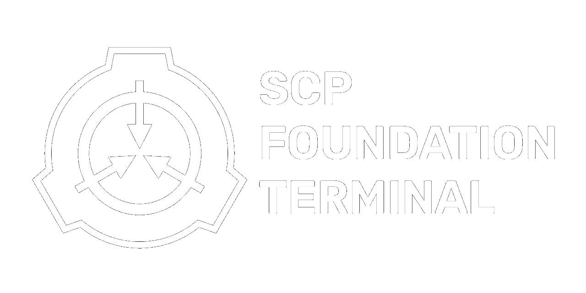

<h1 align="center">
  <br>
</h1>

This terminal based web scraping program retrieves data from the SCP Wiki site about the SCP Foundation, enabling users to easily access and save information about the fictional organization.


## 👨‍💻Authors

- [@MidasRX](https://github.com/MidasRX)

## 🛠Credit Original Authors

- [@ashfaaqrifath](https://www.github.com/ashfaaqrifath)


## 📕Packages Used

* shutil
```
  pip install shutil
```
* random
```
  pip install random
```
* datetime
```
  pip install datetime
```
* requests
```
  pip install requests
```
* BeautifulSoup
```
  pip install bs4
```
* pyttsx3
```
  pip install pyttsx3
```
* colorama
```
  pip install colorama
```


## 🛠️Functionalities

- Displays information for a given SCP object
- Saves SCP information in text files
- Emergency terminal lockout
- Incognito mode
- Activity logging
- User registration
- Password login
- Terminal override
- Security features
- Colored outputs

## 🛠️Information

User : Midas
Pass : 7097

Launch launcher.bat if you see any error make Issues Request

## 📜License

[](https://choosealicense.com/licenses/mit/)
Copyright © 2023 Ashfaaq Rifath - SCP Foundation Terminal v2.1.3
Copyright © 2024 MidasR (Zerdium) - SCP Foundation Terminal v2.1.4

## 🔗 Why
Original Project Was Not Updated And Outated I fixed it and maked update

